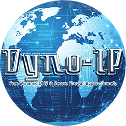

# DynoIP Desktop

<p align="center">
  
</p>

<p align="center">
  <strong>Free Dynamic DNS & Secure Firewall Bypass Tunnels</strong><br>
  A Windows desktop client for managing your <a href="https://dyno-ip.com">DynoIP</a> subdomains and tunnels.
</p>

<p align="center">
  <a href="https://github.com/vehoelite/dynoip-desktop/releases/latest">
    
  </a>
</p>

---

## Features

- **Dynamic DNS** — Automatically updates your subdomain to your current public IP
- **Secure Tunnels** — Create encrypted tunnels to expose local services through firewalls (powered by Newt/Pangolin)
- **Auto-Reconnect** — Tunnels persist across reboots with exponential backoff retry
- **Dashboard** — Live health probes, IP status, and resource usage at a glance
- **Access Control** — IP allowlists and password protection for subdomains and tunnels
- **DNS Management** — Create and manage A, AAAA, CNAME, TXT, and MX records
- **System Tray** — Runs in the background, minimizes to tray

## Screenshots

*Coming soon*

## Installation

1. Download **DynoIP-Setup-x.x.x.exe** from the [Releases](https://github.com/vehoelite/dynoip-desktop/releases/latest) page
2. Run the installer (Windows SmartScreen may warn — the app is unsigned during alpha)
3. Launch DynoIP and sign in with your [dyno-ip.com](https://dyno-ip.com) account

> **Requirements:** Windows 10/11 (x64)

## Development

### Prerequisites

- [Node.js](https://nodejs.org/) 18+
- npm

### Setup

```bash
git clone https://github.com/vehoelite/dynoip-desktop.git
cd dynoip-desktop
npm install
```

### Run

```bash
npm run dev
```

### Build Installer

```bash
npm run package
```

Output: `dist/DynoIP-Setup-x.x.x.exe`

## Tech Stack

| Layer | Technology |
|-------|-----------|
| Framework | Electron 33 |
| Frontend | React 19 + TypeScript |
| Styling | Tailwind CSS v4 |
| Routing | React Router 7 |
| Build | electron-vite + electron-builder |
| Storage | electron-store (encrypted) |

## Security

- Per-installation unique encryption key for local credential storage
- Chromium sandbox enabled with context isolation
- Content Security Policy enforced in production
- DevTools disabled in release builds
- Tunnel credentials wiped on logout

## License

All rights reserved. This software is proprietary to [Novamind Labs](https://dyno-ip.com).

## Links

- **Website:** [dyno-ip.com](https://dyno-ip.com)
- **Issues:** [GitHub Issues](https://github.com/vehoelite/dynoip-desktop/issues)
